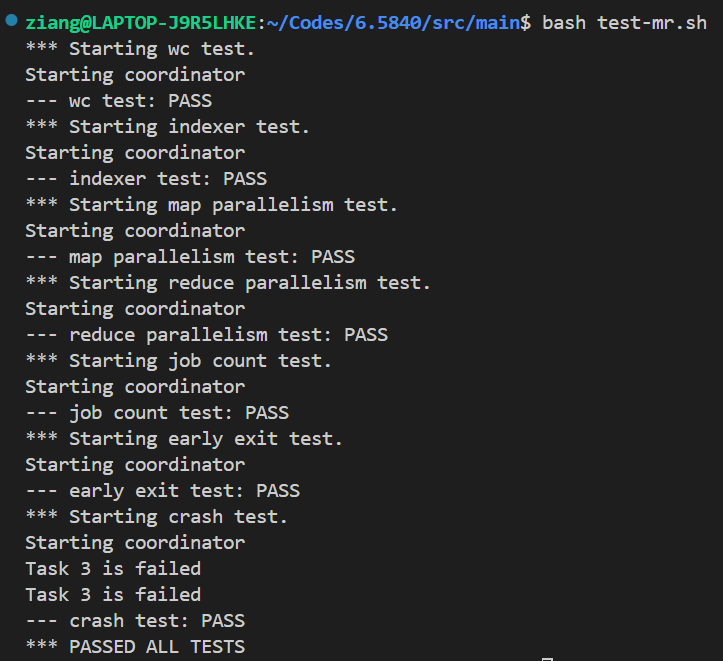
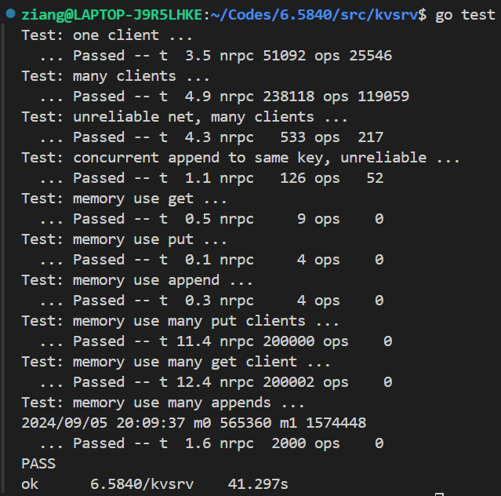
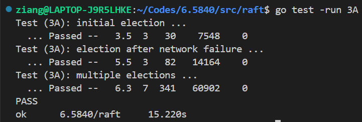
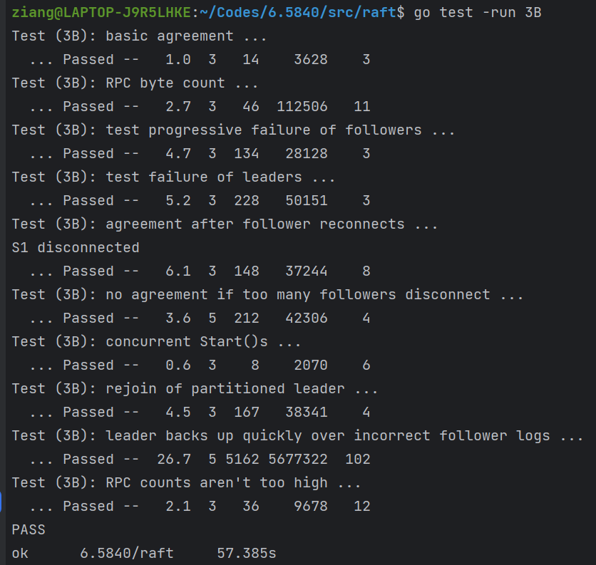
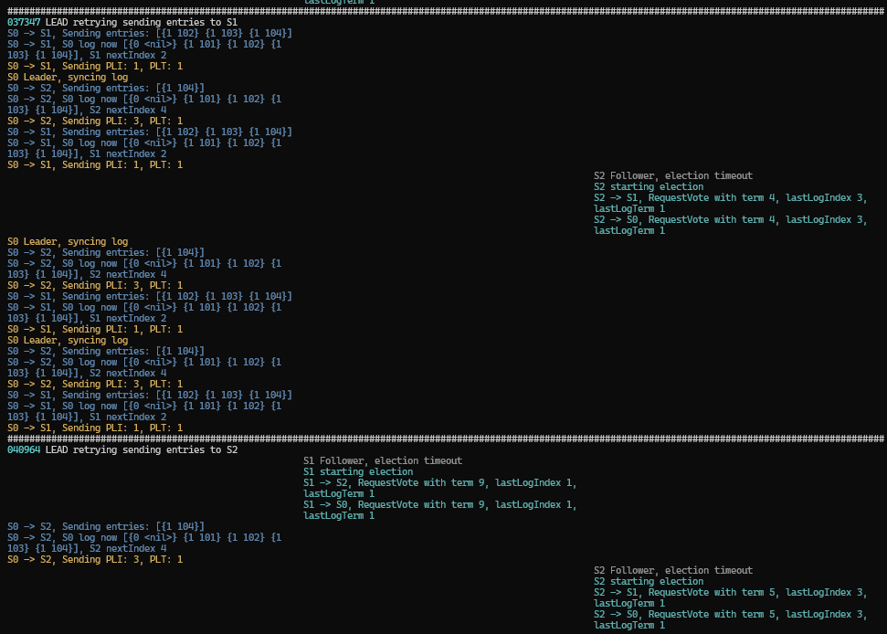

# MIT: Distributed Systems

## Lab 1

## Lab2

## Lab3

### Lab3-A

> **Reference that can be of help**
> 
> 1. [Student's Guide](https://thesquareplanet.com/blog/students-guide-to-raft/) This is a LIFE SAVER
> 2. [Raft Locking Advice](https://pdos.csail.mit.edu/6.824/labs/raft-locking.txt)
> 3. [Raft Structure Advice](https://pdos.csail.mit.edu/6.824/labs/raft-structure.txt)
> 4. [github discussion 1 (in chinese)](https://github.com/springfieldking/mit-6.824-golabs-2018/issues/1)
> 5. [github discussion 2 (in chinese)](https://github.com/springfieldking/mit-6.824-golabs-2018/issues/3)

### Lab3-B

For 3B I restructured and rewrote the entire code 3 times and did numerous tests. Finally passed it after 12 days of on-and-off debugging and expansive researching. I resorted to the `dslogs` in [this post](https://blog.josejg.com/debugging-pretty/) and it's been so helpful. This is how the debug log looks like on my terminal:

Other than this I also turned to Goland instead of VSCode for better debugging and clearer display. (VSCode still reigns regardless)